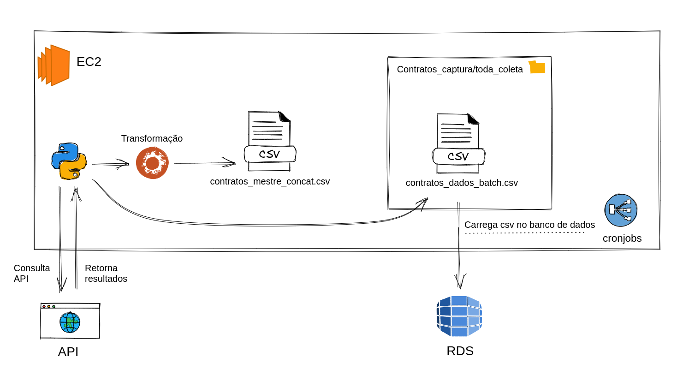
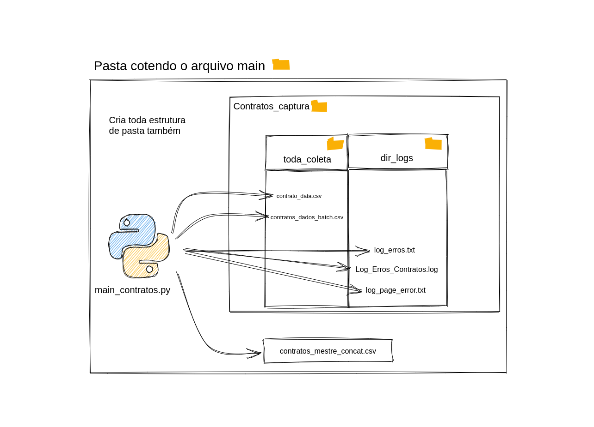

# :detective: Extração de dados da API SOF - V.0 :card_file_box:

<br> </br>

## SUMÁRIO

- ### [Motivação](#motivação)
- ### [Como replicar o Projeto](#como-replicar-este-projeto)
  - #### [Preceitos do projeto](#preceitos-do-projeto)
  - #### [Introdução](#introdução)
  - #### [API SOF](#api-sof)
  - #### [Criando Ambiente Virtual](#criando-ambiente-virtual)
  - #### [Extraindo os Dados da API](#extraindo-os-dados-da-api)
- ### [Configurando recursos na AWS](#configurando-recursos-na-aws)
- ### [Agendamentos na AWS](#agendamentos-na-aws)
- ### [Conclusão](#conclusão)
- ### [Próximas etapas](#próximas-etapas)
- ### [Contato](#contato)

<br> </br>

## Motivação

Antes de falarmos sobre a extração dos dados da API SOF preciso contextualizar para melhor compreensão da motivação desta primeira parte do projeto.
Esta etapa de extração faz parte de um projeto de controle social que tem por objetivo o monitoramento e controle dos processos licitatórios da **Câmara Municipal da Cidade de São Paulo**.

A Prefeitura da Cidade de São Paulo tem uma política de dados abertos bem presente, na atualidade. Sem entrar em detalhes dos tipos de licitação, existe a possibilidade de saber o andamento de pagamento  através de alguns sites como o [e-Negócios](http://e-negocioscidadesp.prefeitura.sp.gov.br/) e o [SEI](http://processos.prefeitura.sp.gov.br/Forms/consultarProcessos.aspx). Mas a PRODAM, empresa de economia mista vinculada à Prefeitura de São Paulo, desenvolveu a API do Sistema de Orçamento e Finanças(SOF) e disponibilizou diversos dados. Na API disponibilizada existem 7 grandes conjuntos de dados relevantes para análises e outras 16 tabelas listando códigos dos atributos.  
Neste momento como exemplo será usado a tabela ***contratos***.
<br> </br>

# Como replicar este projeto

## Preceitos do projeto


- Tudo foi pensado para ajudar no projeto de controle social,
- Para o projeto é importante saber os dados "novos e alterados" a cada coleta,
- Serviços da AWS devem estar prontos já (*EC2* e *RDS*),
- Sistema operacional na instância: Linux Ubuntu 18.04,
- Banco de dados relacional: MySQL

---  


## Introdução

O projeto apresentado aqui se propõe a fazer coleta dos dados da tabela **Contratos** de forma automática e armazenar em um banco de dados relacional na **AWS** usando a versão gratuita do serviço **RDS**.  Ressalto que se trata de uma arqiutetura bem simples e que atendeu as demandas do projeto. Na fase atual do projeto está sendo avaliado o uso do Jenkins e Aiflow para melhorar as automatizações e os testes também. Em breve também compartilharei a versão 2 deste projeto com estas novas formas aplicadas.
<br> </br>
Então para esta versão inicial será abordado os scripts necessários em python e bash para :

- ***Extrair os dados da API SOF e fazer as transformações necessárias***, 
- ***Carregar os dados para um banco de dados relacional***,
- ***Fazer agendamentos na AWS usando cronjobs***, 

  
Para dar um panorama geral de como tudo vai funcionar, veja a figura 1.


***Figura 1*** - Visão geral do processo de coleta de dados e ingesstão em banco de dados  


Este projeto é parte de um trabalho para controle social e tem por objetivo ajudar outras pessoas que queiram explorar os dados do SOF(Sistema de Orçamento e Finanças) e terem um projeto de base. É uma versão que usa recursos gratuitos da AWS e que ainda não aplica as melhores práticas. Mas é uma arquitetura que atinge resultados para o que se proprõe. E em dado momento futuro irei propor outra solução usando Docker para que outras pessoas consigam executar todo o processo de forma mais fácil. E do ponto de vista de serviços da AWS é posśivel estabelecer uma arquitetura de serviços mais robusta, que também será implementada na versão seguinte.

A seguir iremos abordar os principais tópicos e todos os pontos necessários para que você consiga o mesmo objetivo deste projeto.
<br> </br>

## API SOF


#### Inscreva-se   :fountain_pen:
- [Cadastre-se na API para criar um usuário](https://api.prodam.sp.gov.br/store/apis/info?name=SOF&version=v3.0.1&provider=admin&#/)
- Faça login e vá até a aba `API CONSOLE` e copie para um local seguro o `TOKEN` (iremos precisar logo mais)
- Acesse o conteúdo da documentação para ficar por dentro de tudo.

Uma vez tendo seu `TOKEN` de acesso agora você deve criar um arquivo `.env ` usando uma IDE de sua preferência.  
E dentro deste arquivo você deverá seguir o modelo abaixo colocando o `TOKEN`que você obteve.

```sh
TOKEN = 'coleque_seu_token_aqui_entre_aspas_simples'
```

O script **main_contratos.py** irá ler este aqruivo `.env`, por isso é importante que você tenha feito isso antes de iniciar o script.
<br> </br>

## Criando ambiente virtual

Na pasta que você tiver deixado o script main_contrato.py você deverá criar o ambiente virtual. Neste exemplo irei usar o `virtualenv` mas você pode escolher o de sua preferência.

Se não tiver instalado instale-o.

```sh
pip install virtualenv
```

Agora que tem certaza de tê-lo instalado, agora crie um ambiente da seguinte forma:

```sh
virtualenv .venv
```

E para ativar o ambiente criado use:

```sh
source .venv/bin/activate
```
Para instalar os pacotes necessários use o comando abaixo:

```sh
pip install -r requirements.txt
```

<br> </br>

## Extraindo os dados da API

Agora que já temos o login e as credenciais na APIS do SOF é possível trabalhar no script de coleta de dados.
O script principal é o **main_contratos.py**. A figura abaixo ajuda a ilustrar  os produtos deste script.
A primeira coisa a ser feita é manter o arquivo **csv** chamado **contratos_mestre_concat.csv** na pasta raiz junto do script citado. A segunda etapa importante é definir o(s) ano(s) a serem coletados. Para isso abra o arquivo **anos.py** e atribua um ou vários anos separados por vírgula atráves de uma lista, como no exemplo abaixo. Os anos precisam estar no formato YYYY.

```python
# Se for usar vários anos use conforme modelo -> anos = [2019,2020,2021]
anos = [2021]
```

Dito isso, ao rodar o script será criado as pastas para ajudar na organização da coleta dos dados, como ilustrado na **figura 2**.


**Figura 2** - Estrutura de pastas

Se tudo foi seguido até aqui o script rodou com sucesso. As etapas feitas aqui aqui podem ser feitas no computador local. No entanto se quiser aplicar estas etapas em um fluxo automático e que armazene em um banco de dados relacional gratuito, será preciso agora iniciar uma etapa de configuração dos recursos dentro da AWS.
<br> </br>


<br> </br>

## Configurando recursos na AWS

<p align="center">
  
</p>


### 1) Crie uma conta gratuita e configure uma instância EC2

Para esta etapa irei deixar alguns recursos bem como link para criar sua conta e já configurar uma instância EC2(que irá rodar os scripts). Vários serviços da AWS possuim um nível gratuito(free tier). Para ver mais sobre quais serviços e condições estão disponíveis acesse [este link da AWS](https://aws.amazon.com/pt/free/?all-free-tier.sort-by=item.additionalFields.SortRank&all-free-tier.sort-order=asc&awsf.Free%20Tier%20Types=*all&awsf.Free%20Tier%20Categories=*all). Mas saiba que para este projeto a versão gratuita já irá atender.  

Você pode seguir as instruções contidas [nesta página da AWS](https://docs.aws.amazon.com/pt_br/AWSEC2/latest/UserGuide/get-set-up-for-amazon-ec2.html) para cadastrar, criar um par de chaves e criar a segurança necessária de configuração e depois saber mais sobre o uso do EC2.  

E para se conectar à instância EC2 sugiro a leitura [desta instrução da AWS](https://docs.aws.amazon.com/pt_br/AWSEC2/latest/UserGuide/AccessingInstancesLinux.html).  Utilize o método de conexão via **SSH**.

E uma dica adicional aqui é sobre a segurança de sua conta na AWS. Assista [este video a partir da marcação do video](https://youtu.be/rMxDyEZQarY) para saber como criar uma autenticação de segurança, um aviso de cobrança na conta e um usuário não root. Assita os 13 minutos após o início da marcação deste link e você terá as noções básicas de segurança na conta e evitará possíveis dores de cabeça.
<br> </br>

  
### 2) Crie o banco de dados 

Para criar sua primeira instância de banco de dados RDS [use este artigo aqui como guia](https://docs.aws.amazon.com/AmazonRDS/latest/UserGuide/CHAP_GettingStarted.CreatingConnecting.MySQL.html).

Para se conectar à instância de banco de dados, [use este documento da AWS para saber como conectar via shell ou com um software](https://docs.aws.amazon.com/pt_br/AmazonRDS/latest/UserGuide/USER_ConnectToInstance.html). 

Depois de conectado agora é possível criar a tabela. Crie um schema e depois a tabela de contratos. Para a criação de tabela, lembre-se de fazer login na API e ir até a aba **Documentação**  e baixar o manual contendo todas informações relevantes para a criação da tabela.

  > **IMPORTANTE** : No manual do SOF na página 30 onde existe o descritivo das colunas e tipo, o campo `nunOriginalContrato` está como **inteiro**. Esta informação está **errada** pois neste campo existem dados que possuem letras também. Portanto, ao criar a tabela utilize o campo como tipo **varchar**. Se não fizer esta correção os carregamentos causarão quebra.

Também será preciso durante a criação da tabela a adição de uma coluna chamada ***coletado***, que receberá as datas de quando ocorreu a coleta. Para este momento está sendo usado como tipo `string`(char ou varchar).

Uma vez criado a tabela agora é preciso carregar os dados. Existem algumas formas de fazer este carregamento de dados em `csv` para a tabela que agora existe na instância *RDS* da AWS.

Como o objetivo é automatizar este carregamento, usaremos *bash scripting*. Caso queira executar em um banco de dados local ou fazer de forma manual basta se conectar ao banco e fazer a carga.

No caso de carga automatizada precisamos criar o script para que não seja pedido as credencias. E para nos ajudar usaremos um recurso da linguagem MySQl: **mysql_config_editor** ! Com ele será possível criar um perfil de conexão e passar previamente as credenciais. E no script bash chamaremos o perfil, não precisando inserir as senhas ou deixando-as visível no script.

Para saber mais sobre como usar esta função acesse [este recurso](http://manpages.ubuntu.com/manpages/trusty/man1/mysql_config_editor.1.html) ou acesse a [documentação do mysql](https://dev.mysql.com/doc/refman/8.0/en/mysql-config-editor.html) para saber todos os detalhes da função.

Abaixo o exemplo de como usar ***bash scripting*** para fazer o carregamento dos dados únicos e novos para dentro do banco de dados relacional *schema_contratos* na tabela **contratos**.


```sh
#!/usr/bin/expect
/usr/bin/mysql --login-path=awslogin <<EOFMYSQL
LOAD DATA LOCAL INFILE '/home/ec2-user/docs_projeto/Contratos_captura/toda_coleta/contratos_dados_batch.csv' 
INTO TABLE schema_contratos.contratos FIELDS TERMINATED BY ',' 
ENCLOSED BY '"' 
LINES TERMINATED BY '\n' 
IGNORE 1 LINES;
EOFMYSQL
echo " Operação realizada com sucesso! Carga de novos dados feita para DB !"

```  


Agora que já se tem um script capaz de coletar os dados, armazenar temporariamente na instância EC2 e carregar para um banco de dados podemos agora criar agendamentos para execução destas etapas.  
<br> </br>

  
  

## Agendamentos na AWS

  >   *Importante : Como a API que retorna os dados de **contratos** traz os resultados do ano todo, todo começo de ano retornará os resultado de forma rápida. No entanto, com o passar do tempo, os retornos ultrapassam 15 minutos. E para este projeto temos a necessidade de sempre estar retornando dois a três anos consecutivos pois o pagamento de uma licitação pode levar mais de 12 meses, portanto, aparecendo no ano seguinte, por exemplo.*

Para o agendamento não usamos a **AWS Lambda** (tempo de execução máximo da lambda é de 15 minutos) pelo motivo citado acima mas é possível criar um container e usar **AWS ECS** e **Fargate** para contornar esta situação. Para este projeto irei mostrar o caminho que foi usado como primeira solução, usando *cronjobs*.

Para agendarmos a execução dos scripts foi usado ***cronjob***, nativo do sistema operacional do *Linux*. E para saber como gerar a combinação da periodicidade desejsada existe um site que te ajuda a criar chamado [*crontab.guru*](https://crontab.guru/).

Para criar o agendamento digite no terminal dentro de sua instância *EC2*:
```sh
crontab -e
```

E vai te abrir no terminal um editável. Para editar você deve pressionar tecla ***"i"*** para entrar no modo *INSERT*.
Neste momento, pode ser preciso algum conhecimento de bash scripting(*nada que o google não possa lhe ensinar!*)
Cole a sequência que obteve usando o **crontab.guru**  + o comando em *bash* e em seguida pressione a tecla ***"ESC"*** e depois ' ***:wq*** ' para salvar(w) e sair(q). 
Abaixo um exemplo usado para executar o main_contratos.py e outro para carregar os dados para o banco de dados MySQL.

```sh
30 12 * * 3  ~/meus_doc/env/bin/python3 /home/ec2-user/docs_projeto/main_contratos.py
30 15 * * 3  bash /home/ec2-user/docs_projeto/load_to_RDS.sh
``` 
O agendamento acima diz que os scripts serão executados toda quarta-feira. O primeiro irá executar as 12:30h e o segundo as 15:30.

Se precisar listar os jobs agendados basta usar o comando:
```sh
crontab -l
```
Uma vez agendado os jobs para você checar se foi realizado com sucesso ou ter pistas sobre o erro basta você acessar o caminho seguinte em sua instância EC2:

```sh
cat /var/spool/mail/ec2-user
```
Por isso é importante colocar alguns *prints* em seu código para ajudar a debugar. E você pode configurar o job para enviar para um e-mail predefinido. Também não é dificil encontrar artigos explicando como fazer isso.

É muito importante checar com certa periodicidade se houve falha do código ou alguma falha de extração de página específica. Por experiência de uso da API constato que de forma aleatória algumas páginas chegam a ficar inacessíveis por vários dias. Os erros retornadas da API são sempre `500` e `502`, indicando falha do servidor. É por esta razão que no script **main_contratos.py**, no caso de falha em alguma página, gera uma lista com as páginas. Isto serve para que seja feita uma nova coleta pontual, quando necessário.


## Conclusão

Espero que com estas informações você seja capaz de explorar a API SOF, coletar os dados e armazenar em um banco de dados relacional. A partir desta arquitetura é possível fazer análises de como ocorre a evolução de pagamentos(empenhos) das licitações, identificar licitações que tiveram atualizações de pagamentos e ainda ter o histórico de como ocorre os pagamentos de todas licitações da Câmara Municipal de São Paulo.   

Este projeto é somente uma parte que trata da obtenção e persistência dos dados, a parte subsequente das análises e identificação de irregularidades nos processos licitatórios não será contemplada neste repositório para garantir a continuidade do projeto até que seja publicado.
O monitoramento e controle das atividades são etapas essencias no controle social e exercício da cidadania. Existe uma infinta gama de possibilidades para ajudar no controle social e gradativamente irei adicionando formas melhores e mais eficientes de extração, transformação, armazenamento e disponibilização dos dados para análises.
Se tem sugestões de melhorias, quer contribuir ou simplesmente saber mais sobre o projeto entre em contato comigo.


# Próximas etapas

|Melhorias                     |Motivo                            |Status Implementação                                      |
|-------------------|-----------------------|-------------------|
| Teste Unitário | Garantir a qualidade e eficácia do código |Em andamento |
|Uso do serviço S3              |Outras fontes de dados estão se juntando e é preciso garantir a persistência dos dados, acesso e escalabilidade                   |Backlog           |


<br> </br>

## Contato


 **Linkedin:** [**Richard Silva**](https://www.linkedin.com/in/richard-br/)
